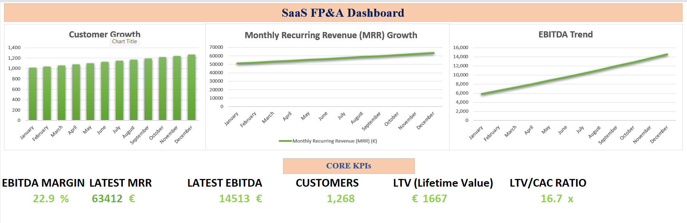

#  SaaS FP&A Financial Model

This project is a Financial Planning & Analysis (FP&A) model built in Excel, simulating the financial operations of a SaaS business.

---

##  Project Overview

The model is designed to replicate real-world FP&A workflows, including forecasting, variance analysis, and scenario planning. It links operational drivers such as customer growth and churn to financial performance.

---

##  Dashboard Preview

---

##  Key Features

- Driver-based revenue model (MRR, customer growth, churn)
- Cost structure including Customer Acquisition Cost (CAC), fixed and variable costs
- Full Profit & Loss (P&L) statement with EBITDA calculation
- Forecast vs Actual variance analysis
- Scenario analysis (Base, Best, Worst cases)
- Interactive KPI dashboard

---

##  Key Metrics

- Monthly Recurring Revenue (MRR)
- EBITDA and EBITDA Margin
- Customer growth and churn
- Customer Acquisition Cost (CAC)
- Lifetime Value (LTV)
- LTV/CAC ratio

---

##  Key Insights

- Revenue growth is primarily driven by customer acquisition, with churn acting as a constraint
- Profitability improves over time due to operating leverage from stable fixed costs
- Strong unit economics demonstrated by high LTV/CAC ratio
- Financial performance is sensitive to changes in churn and acquisition cost assumptions

---

##  Tools Used

- Microsoft Excel

---

##  Purpose

This project was developed to demonstrate practical FP&A skills, including financial modeling, forecasting, and data-driven decision-making.

---

##  Files Included

- SaaS FP&A Model – Forecasting, Variance & Scenario Analysis.xlsx

---
